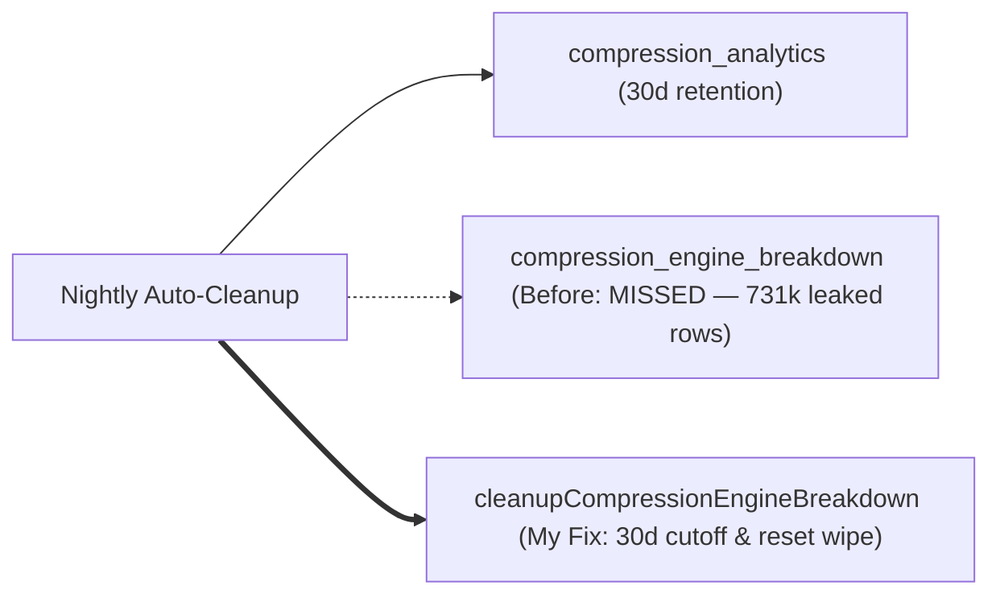
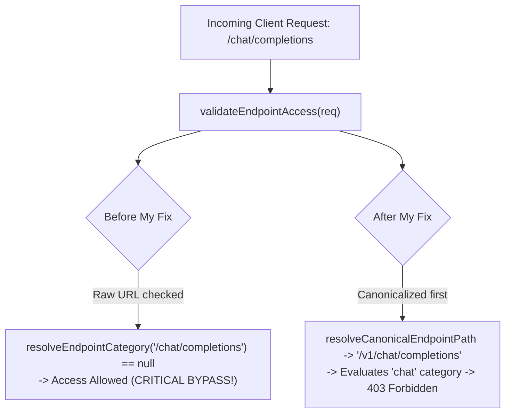
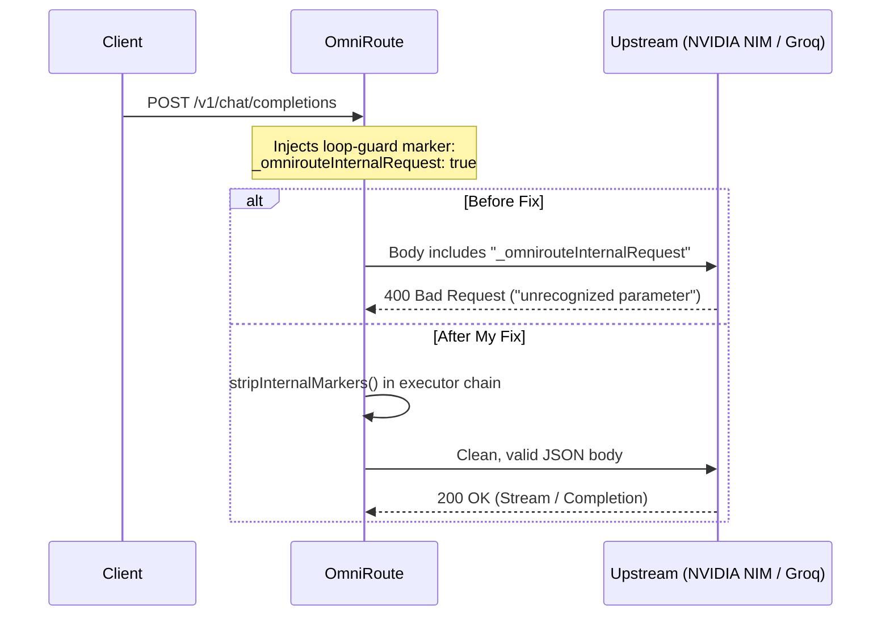

# 🛠️ Upstream Maintenance Log & Live Engineering Changelog

> **Autonomous Running Log**: Tracks all production pull requests, commits, and releases authored by [@gonisulaimann](https://github.com/gonisulaimann) across any public repository on GitHub. Automatically synced via GitHub Actions.

[](https://github.com/pulls?q=is%3Apr+author%3Agonisulaimann+is%3Amerged) 
[](https://github.com/pulls?q=is%3Apr+author%3Agonisulaimann+is%3Aopen) 
[](https://github.com/gonisulaimann) 
[](https://github.com/gonisulaimann/gonisulaimann/actions)

```
Telemetry Snapshot (2026-09-20 20:40 UTC):
├── Total Tracked Upstream PRs : 31
├── Production Merged PRs      : 16 (51.6%)
├── In-Flight / In Review      : 10
└── Public Repositories Active : 9
```

## 📊 Live Activity & Contribution Graphs

[](https://github.com/gonisulaimann)

---

## 🟡 In-Flight & Active Pull Requests (Queue & Review)

Pull requests currently under review, undergoing checks, or queued in merge-trains across upstream systems.

| Repository | PR | Live Status | Scope & What I Found / Did | Created |
| :--- | :--- | :---: | :--- | :---: |
| **[diegosouzapw/OmniRoute](https://github.com/diegosouzapw/OmniRoute)** | **[#14285](https://github.com/diegosouzapw/OmniRoute/pull/14285)** | [](https://github.com/diegosouzapw/OmniRoute/pull/14285) | **Storage & Database**: Fixed 731k+ leaked telemetry rows in `compression_engine_breakdown` (#14268). Wired table into retention cleanup (30d default) and `RESET_TARGETS`. | `2026-09-20` |
| **[diegosouzapw/OmniRoute](https://github.com/diegosouzapw/OmniRoute)** | **[#14281](https://github.com/diegosouzapw/OmniRoute/pull/14281)** | [](https://github.com/diegosouzapw/OmniRoute/pull/14281) | **Transports & Protocols**: Wired Codex App-Server WebSocket transport dispatch and normalized reasoning model aliases (`-low`, `-medium`, `-high`) into turn effort parameters (#14277). | `2026-09-20` |
| **[diegosouzapw/OmniRoute](https://github.com/diegosouzapw/OmniRoute)** | **[#14275](https://github.com/diegosouzapw/OmniRoute/pull/14275)** | [](https://github.com/diegosouzapw/OmniRoute/pull/14275) | **LiveWS / Real-Time**: Allowed anonymous dashboard LiveWS connections when `requireLogin=false` (#14256), fixing local disconnections. | `2026-09-20` |
| **[diegosouzapw/OmniRoute](https://github.com/diegosouzapw/OmniRoute)** | **[#14274](https://github.com/diegosouzapw/OmniRoute/pull/14274)** | [](https://github.com/diegosouzapw/OmniRoute/pull/14274) | **Storage / Boot**: Silenced false-alarm boot crashes for legacy Bifrost slot index renumbering (#14262). | `2026-09-20` |
| **[diegosouzapw/OmniRoute](https://github.com/diegosouzapw/OmniRoute)** | **[#14271](https://github.com/diegosouzapw/OmniRoute/pull/14271)** | [](https://github.com/diegosouzapw/OmniRoute/pull/14271) | **Routing / Engine**: Recursively expanded combo-ref targets when computing capabilities (#14232) to prevent capability masking. | `2026-09-20` |
| **[diegosouzapw/OmniRoute](https://github.com/diegosouzapw/OmniRoute)** | **[#14185](https://github.com/diegosouzapw/OmniRoute/pull/14185)** | [](https://github.com/diegosouzapw/OmniRoute/pull/14185) | **Ingress / Protocols**: Corrected ingress body classifier for non-standard `/v1beta` routes to OpenAI format. | `2026-09-19` |
| **[diegosouzapw/OmniRoute](https://github.com/diegosouzapw/OmniRoute)** | **[#14184](https://github.com/diegosouzapw/OmniRoute/pull/14184)** | [](https://github.com/diegosouzapw/OmniRoute/pull/14184) | **Networking**: Probe HTTP proxies on default port 80 when port is omitted in connection string. | `2026-09-19` |
| **[diegosouzapw/OmniRoute](https://github.com/diegosouzapw/OmniRoute)** | **[#14155](https://github.com/diegosouzapw/OmniRoute/pull/14155)** | [](https://github.com/diegosouzapw/OmniRoute/pull/14155) | **CI / Tooling**: Fixed env/doc synchronization gates on checkouts whose paths need URL encoding. | `2026-09-19` |
| **[diegosouzapw/OmniRoute](https://github.com/diegosouzapw/OmniRoute)** | **[#14153](https://github.com/diegosouzapw/OmniRoute/pull/14153)** | [](https://github.com/diegosouzapw/OmniRoute/pull/14153) | **Streaming / Translator**: Prevented post-close trailing text chunks from corrupting completed Responses message items. | `2026-09-19` |
| **[Centre-For-Energy/ceii-platform](https://github.com/Centre-For-Energy/ceii-platform)** | **[#6](https://github.com/Centre-For-Energy/ceii-platform/pull/6)** | [](https://github.com/Centre-For-Energy/ceii-platform/pull/6) | feat(frontend): preview programs content from the homepage | `2026-09-09` |

---

## 🟢 Merged Production Pull Requests (Shipped Upstream)

Production code merged into default branches across AI proxies, native desktop tools, and web infrastructure.

| Repository | PR | Status | Description & Engineering Summary | Merged Date |
| :--- | :--- | :---: | :--- | :---: |
| **[gonisulaimann/Grounded](https://github.com/gonisulaimann/Grounded)** | **[#3](https://github.com/gonisulaimann/Grounded/pull/3)** | [](https://github.com/gonisulaimann/Grounded/pull/3) | **Typing / Packaging**: Package PEP 561 `py.typed` marker for static type checker compliance across consumers. | `2026-09-20` |
| **[gonisulaimann/Grounded](https://github.com/gonisulaimann/Grounded)** | **[#2](https://github.com/gonisulaimann/Grounded/pull/2)** | [](https://github.com/gonisulaimann/Grounded/pull/2) | **Test Harness**: Bootstrap sys.path in test runner for zero-install discovery across environments. | `2026-09-20` |
| **[diegosouzapw/OmniRoute](https://github.com/diegosouzapw/OmniRoute)** | **[#12735](https://github.com/diegosouzapw/OmniRoute/pull/12735)** | [](https://github.com/diegosouzapw/OmniRoute/pull/12735) | **Streaming / Egress**: Stripped internal proxy routing markers (`_omniroute*`) from outgoing request bodies (#12729), preventing upstream 400 Bad Request on strict providers (NVIDIA NIM, Groq). | `2026-09-18` |
| **[diegosouzapw/OmniRoute](https://github.com/diegosouzapw/OmniRoute)** | **[#13741](https://github.com/diegosouzapw/OmniRoute/pull/13741)** | [](https://github.com/diegosouzapw/OmniRoute/pull/13741) | **Security / Policy**: Fixed critical authorization bypass on URL rewrite aliases (#13685) via canonical path normalization in `validateEndpointAccess`. | `2026-09-18` |
| **[diegosouzapw/OmniRoute](https://github.com/diegosouzapw/OmniRoute)** | **[#12736](https://github.com/diegosouzapw/OmniRoute/pull/12736)** | [](https://github.com/diegosouzapw/OmniRoute/pull/12736) | **Frontend / Settings**: Exposed Modal Base URL field in provider connection modal (#12704). | `2026-09-18` |
| **[Filecraft/Filecraft](https://github.com/Filecraft/Filecraft)** | **[#8](https://github.com/Filecraft/Filecraft/pull/8)** | [](https://github.com/Filecraft/Filecraft/pull/8) | **Distribution**: Consumer distribution updates and release verification. | `2026-09-14` |
| **[Filecraft/Filecraft](https://github.com/Filecraft/Filecraft)** | **[#7](https://github.com/Filecraft/Filecraft/pull/7)** | [](https://github.com/Filecraft/Filecraft/pull/7) | **System Test Harness**: Gated macOS GUI harness on proven synthetic event delivery (virtual F13 probe) to eliminate post-reboot CI flakes. | `2026-09-13` |
| **[Filecraft/Filecraft](https://github.com/Filecraft/Filecraft)** | **[#6](https://github.com/Filecraft/Filecraft/pull/6)** | [](https://github.com/Filecraft/Filecraft/pull/6) | **Distribution**: Release packaging and distribution pipeline hardening for macOS consumer binaries. | `2026-09-12` |
| **[Centre-For-Energy/ceii-platform](https://github.com/Centre-For-Energy/ceii-platform)** | **[#5](https://github.com/Centre-For-Energy/ceii-platform/pull/5)** | [](https://github.com/Centre-For-Energy/ceii-platform/pull/5) | **Programs**: Engineered institutional research programs page. | `2026-09-09` |
| **[Centre-For-Energy/ceii-platform](https://github.com/Centre-For-Energy/ceii-platform)** | **[#4](https://github.com/Centre-For-Energy/ceii-platform/pull/4)** | [](https://github.com/Centre-For-Energy/ceii-platform/pull/4) | **Governance**: Built institutional governance portal and policy navigation layout. | `2026-09-09` |
| **[Centre-For-Energy/ceii-platform](https://github.com/Centre-For-Energy/ceii-platform)** | **[#3](https://github.com/Centre-For-Energy/ceii-platform/pull/3)** | [](https://github.com/Centre-For-Energy/ceii-platform/pull/3) | **Frontend**: Established institutional About page and shared layout framework. | `2026-09-09` |
| **[Centre-For-Energy/ceii-platform](https://github.com/Centre-For-Energy/ceii-platform)** | **[#2](https://github.com/Centre-For-Energy/ceii-platform/pull/2)** | [](https://github.com/Centre-For-Energy/ceii-platform/pull/2) | **Frontend**: Engineered institutional homepage with responsive accessibility primitives. | `2026-09-08` |
| **[Centre-For-Energy/ceii-platform](https://github.com/Centre-For-Energy/ceii-platform)** | **[#1](https://github.com/Centre-For-Energy/ceii-platform/pull/1)** | [](https://github.com/Centre-For-Energy/ceii-platform/pull/1) | **Architecture**: Established foundational application shell, design system component primitives, and modular routing. | `2026-09-08` |
| **[diegosouzapw/OmniRoute](https://github.com/diegosouzapw/OmniRoute)** | **[#12369](https://github.com/diegosouzapw/OmniRoute/pull/12369)** | [](https://github.com/diegosouzapw/OmniRoute/pull/12369) | **Localization**: Escaped placeholder variables in ICU single quotes across all 43 locales to prevent onboarding crashes. | `2026-09-04` |
| **[diegosouzapw/OmniRoute](https://github.com/diegosouzapw/OmniRoute)** | **[#12368](https://github.com/diegosouzapw/OmniRoute/pull/12368)** | [](https://github.com/diegosouzapw/OmniRoute/pull/12368) | **CLI Runtime**: Removed duplicate positional parameter in tunnel create CLI command. | `2026-09-04` |
| **[diegosouzapw/OmniRoute](https://github.com/diegosouzapw/OmniRoute)** | **[#12371](https://github.com/diegosouzapw/OmniRoute/pull/12371)** | [](https://github.com/diegosouzapw/OmniRoute/pull/12371) | **Model Registry**: Restricted reasoning effort parameters to Kimi K3 base models only. | `2026-09-04` |

---

## ⚡ Live Commit Stream (Recent Direct Commits & Pushes)

Extracted dynamically from public commit activity across all canonical repositories.

| Repository | Commit | Message | Date |
| :--- | :---: | :--- | :---: |
| **[gonisulaimann/gonisulaimann](https://github.com/gonisulaimann/gonisulaimann)** | [`2799ac8`](https://github.com/gonisulaimann/gonisulaimann/commit/2799ac8a1101fc1ed05c9d451d638ee937927331) | docs: update maintenance log link text | `2026-09-20` |
| **[gonisulaimann/gonisulaimann](https://github.com/gonisulaimann/gonisulaimann)** | [`a9b8e7d`](https://github.com/gonisulaimann/gonisulaimann/commit/a9b8e7d432a1e6f57c13c22cd1c5f539a368e2aa) | docs: rewrite maintenance log in first-person with engineering diagrams | `2026-09-20` |
| **[gonisulaimann/gonisulaimann](https://github.com/gonisulaimann/gonisulaimann)** | [`002ef05`](https://github.com/gonisulaimann/gonisulaimann/commit/002ef0581c36a91f0f59852763c22a8bf482bf6b) | Add link to Open Source Contribution Index | `2026-09-20` |
| **[gonisulaimann/gonisulaimann](https://github.com/gonisulaimann/gonisulaimann)** | [`3c12e08`](https://github.com/gonisulaimann/gonisulaimann/commit/3c12e08adf609401a37859099b3dbf6023067a93) | Revise README to emphasize community and contributions | `2026-09-20` |
| **[gonisulaimann/gonisulaimann](https://github.com/gonisulaimann/gonisulaimann)** | [`20e3f17`](https://github.com/gonisulaimann/gonisulaimann/commit/20e3f170a2742f76c1214c13fc4358a40ef15ff4) | docs: update profile README to include PR #14285 telemetry retention | `2026-09-20` |
| **[gonisulaimann/gonisulaimann](https://github.com/gonisulaimann/gonisulaimann)** | [`b016570`](https://github.com/gonisulaimann/gonisulaimann/commit/b01657058d36d6a36ad3d63c4316b718d4588636) | docs: document PR #14285 telemetry retention cleanup and case study | `2026-09-20` |
| **[gonisulaimann/Grounded](https://github.com/gonisulaimann/Grounded)** | [`c7e89c4`](https://github.com/gonisulaimann/Grounded/commit/c7e89c422292c5ba2880acf06f25ed9821d39b22) | feat(typing): package PEP 561 py.typed marker for type-checker compliance (#3) | `2026-09-20` |
| **[gonisulaimann/Grounded](https://github.com/gonisulaimann/Grounded)** | [`e32a724`](https://github.com/gonisulaimann/Grounded/commit/e32a724e7af24ce7a79540dd385878562f8a0383) | test: bootstrap sys.path in test runner for zero-install discovery (#2) | `2026-09-20` |
| **[gonisulaimann/gonisulaimann](https://github.com/gonisulaimann/gonisulaimann)** | [`718984a`](https://github.com/gonisulaimann/gonisulaimann/commit/718984a28a92319c30a7f99384d24f6ec3fe46a5) | docs: add comprehensive open-source contribution index and technical case studies | `2026-09-20` |
| **[gonisulaimann/gonisulaimann](https://github.com/gonisulaimann/gonisulaimann)** | [`7eb13e7`](https://github.com/gonisulaimann/gonisulaimann/commit/7eb13e74fa9fda206ce9097e267d7560c62c66cc) | docs: redesign profile architecture around original software and engineering focus | `2026-09-20` |
| **[gonisulaimann/gonisulaimann](https://github.com/gonisulaimann/gonisulaimann)** | [`c68935f`](https://github.com/gonisulaimann/gonisulaimann/commit/c68935f52739942ac74de5770dc4209761ab00e2) | docs: redesign profile README with verified systems engineering contributions | `2026-09-20` |
| **[diegosouzapw/OmniRoute](https://github.com/diegosouzapw/OmniRoute)** | [`5c30568`](https://github.com/diegosouzapw/OmniRoute/commit/5c305680ac7b73b5584dda71e41019c996d37d77) | fix(sse): strip internal markers from the dario and 9router request bodies (#12729) (#12735) | `2026-09-18` |
| **[diegosouzapw/OmniRoute](https://github.com/diegosouzapw/OmniRoute)** | [`21d0e81`](https://github.com/diegosouzapw/OmniRoute/commit/21d0e8133292fa8cc6b041ed50c28c26e9b036a3) | fix(security): enforce allowedEndpoints on the alias rewrites (#13685) (#13741) | `2026-09-18` |
| **[diegosouzapw/OmniRoute](https://github.com/diegosouzapw/OmniRoute)** | [`0551893`](https://github.com/diegosouzapw/OmniRoute/commit/0551893390199c184c386a0d2a9f5a56c45d377a) | fix(dashboard): expose the Modal Base URL field in the connection modals (#12704) (#12736) | `2026-09-18` |
| **[gonisulaimann/Grounded](https://github.com/gonisulaimann/Grounded)** | [`291e794`](https://github.com/gonisulaimann/Grounded/commit/291e794234cd8ac8cb1d7eeb6af658ae5020b003) | v0.5.0: Go support, fix command, exact-path file semantics | `2026-09-17` |
| **[gonisulaimann/Grounded](https://github.com/gonisulaimann/Grounded)** | [`5f40266`](https://github.com/gonisulaimann/Grounded/commit/5f40266a252239d0d81f0ed11a14dbdb96179e71) | Trust files: code of conduct, contributing guide, security policy | `2026-09-17` |
| **[gonisulaimann/Grounded](https://github.com/gonisulaimann/Grounded)** | [`c4a515f`](https://github.com/gonisulaimann/Grounded/commit/c4a515f9651b7937a2d9d3262245b53a65d89a00) | Marketplace: unique action name grounded-lint | `2026-09-17` |
| **[gonisulaimann/Grounded](https://github.com/gonisulaimann/Grounded)** | [`c416522`](https://github.com/gonisulaimann/Grounded/commit/c41652262c1514efcf55f89522bdcf4d7b6ca832) | v0.4.1: fix CI demo count | `2026-09-17` |
| **[gonisulaimann/Grounded](https://github.com/gonisulaimann/Grounded)** | [`2c93a20`](https://github.com/gonisulaimann/Grounded/commit/2c93a2071df2a6042d6f4d186f692c1254496528) | CI: demo fixture count 8 -> 10 (Go file added) | `2026-09-17` |
| **[gonisulaimann/Grounded](https://github.com/gonisulaimann/Grounded)** | [`c43317d`](https://github.com/gonisulaimann/Grounded/commit/c43317d7adb7f19e39a1f2c03ffb299774931966) | v0.4.0: Go support, fix command, suppressions, action, matchers | `2026-09-17` |
| **[gonisulaimann/Grounded](https://github.com/gonisulaimann/Grounded)** | [`f30b2c1`](https://github.com/gonisulaimann/Grounded/commit/f30b2c12e9f5417c5a218cc6fa9e052943d14b29) | Fix action expression syntax for hyphenated inputs (live-fire find) | `2026-09-17` |
| **[gonisulaimann/Grounded](https://github.com/gonisulaimann/Grounded)** | [`77026e9`](https://github.com/gonisulaimann/Grounded/commit/77026e9db73a948d22779921b8305ffd25f570f0) | Adoption bundle: inline suppressions, pre-commit hook, action, problem matchers | `2026-09-17` |
| **[gonisulaimann/Grounded](https://github.com/gonisulaimann/Grounded)** | [`29367ec`](https://github.com/gonisulaimann/Grounded/commit/29367ec5c0f138455e5118500b509a11879e1445) | Untrack local session notes (keep .gitignore current) | `2026-09-17` |
| **[gonisulaimann/Grounded](https://github.com/gonisulaimann/Grounded)** | [`b8422c0`](https://github.com/gonisulaimann/Grounded/commit/b8422c0162048352a7ca7198a377d45482c41a5f) | v0.3.0: baseline files and changed-line gating for legacy adoption | `2026-09-17` |
| **[gonisulaimann/Grounded](https://github.com/gonisulaimann/Grounded)** | [`5fa54c9`](https://github.com/gonisulaimann/Grounded/commit/5fa54c9522bdfceda14218d8a96bc3462a59e62f) | Untrack session notes, bytecode, and add .gitignore | `2026-09-17` |

---

## 🧠 Architectural Deep Dives & Postmortems

Detailed breakdowns of non-trivial production bugs I diagnosed, isolated, and fixed.

### 1. Storage Leak: 731,000+ Orphaned Telemetry Rows in OmniRoute
- **PR**: [OmniRoute #14285](https://github.com/diegosouzapw/OmniRoute/pull/14285) fixing [Issue #14268](https://github.com/diegosouzapw/OmniRoute/issues/14268)
- **Subsystem**: SQLite Storage Engine & Retention Sweeper
- **Diagnosis**: When stacked prompt compression telemetry was added, per-engine breakdown logs were written to `compression_engine_breakdown`. While the parent `compression_analytics` table was regularly trimmed on an operator-configurable retention policy (default 30 days) and purged on usage resets, `compression_engine_breakdown` was omitted from both `cleanup.ts` and `RESET_TARGETS`. In long-running deployments (5+ months), it grew past 731,000 rows without any deletion path.
- **Fix**: Built `cleanupCompressionEngineBreakdown()` with a 30-day indexed cutoff, wired it into nightly auto-cleanup, and added the table to `RESET_TARGETS` so manual purges clean it completely. Tested across 4 unit test suites.



### 2. Security Bypass: Authorization Bypass on URL Rewrite Aliases
- **PR**: [OmniRoute #13741](https://github.com/diegosouzapw/OmniRoute/pull/13741) fixing [Issue #13685](https://github.com/diegosouzapw/OmniRoute/issues/13685)
- **Subsystem**: Reverse Proxy Access Control & API Key Scopes
- **Diagnosis**: When restricted API keys had `allowedEndpoints: ["search"]`, calling client-facing rewrite aliases like `/chat/completions` or `/codex/*` evaluated against `resolveEndpointCategory()`. Because that function only recognized canonical `/v1/...` routes, it returned `null`. The policy engine interpreted `null` as "uncategorized; allow access," permitting restricted keys to invoke unauthorized LLM endpoints.
- **Fix**: Implemented `resolveCanonicalEndpointPath()` to normalize all client aliases to canonical `/v1/...` paths before category resolution, preserving fail-open error handling while closing the bypass completely.



### 3. Egress Leak: Leaked Proxy Routing Markers Triggering Upstream 400s
- **PR**: [OmniRoute #12735](https://github.com/diegosouzapw/OmniRoute/pull/12735) fixing [Issue #12729](https://github.com/diegosouzapw/OmniRoute/issues/12729)
- **Subsystem**: Streaming Egress Serialization
- **Diagnosis**: Internal loop-prevention flags (`_omnirouteInternalRequest`, `_omnirouteSkipContextRelay`) were injected into request bodies during multi-model hops but were never stripped before sending upstream. Strict providers like NVIDIA NIM and Groq reject extra keys with HTTP 400 `Unsupported parameter(s)`, causing 504 logged production failures.
- **Fix**: Audited the executor inheritance tree. Rather than blindly editing all executors, identified that `DarioExecutor` and `NineRouterExecutor` bypassed base dispatch. Added targeted stripping in those specific executors and at the base serialization choke point.



### 4. Flakey CI: Synthetic Event Delivery Probing on macOS
- **PR**: [Filecraft #7](https://github.com/Filecraft/Filecraft/pull/7)
- **Subsystem**: Native macOS System Test Harness (Swift / AppKit)
- **Diagnosis**: The automated GUI test harness suffered non-deterministic CI failures following host reboots because macOS Accessibility preflight APIs frequently report cached success even when the window server is silently dropping synthetic keyboard and mouse events.
- **Fix**: Implemented an active delivery verification probe: before executing test journeys, the harness fires an innocuous virtual `F13` key event and verifies receipt within the run loop. If the host environment drops synthetic events, it falls back to `--human-driven` mode.

---

## 🤖 Autonomous Pipeline Architecture

This document is kept permanently in sync by an autonomous GitHub Actions workflow ([`.github/workflows/sync-maintenance-log.yml`](./.github/workflows/sync-maintenance-log.yml)):

1. **Continuous Ingestion**: Every 6 hours (or upon push), the workflow executes [`scripts/generate_maintenance_log.py`](./scripts/generate_maintenance_log.py).
2. **Cross-Repo Discovery**: Discovers any new pull request, commit, or release authored by `@gonisulaimann` across any public repository on GitHub.
3. **Real-Time State Evaluation**: Parses state transitions (Open ➔ In-Review ➔ Merged) and injects live Shields.io telemetry badges.
4. **Zero-Touch Publishing**: Commits and pushes updates back to `main` without manual intervention.

---

*Maintained autonomously by [@gonisulaimann](https://github.com/gonisulaimann) • Powered by Python & GitHub Actions*
