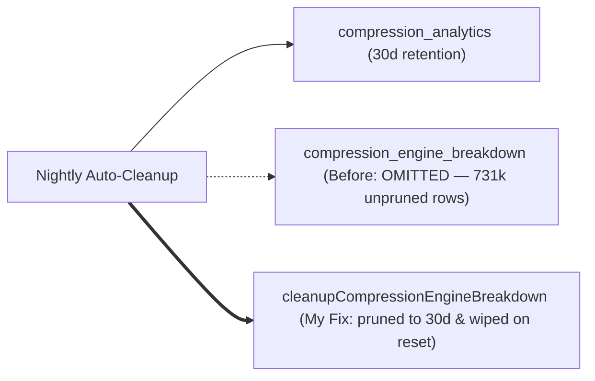
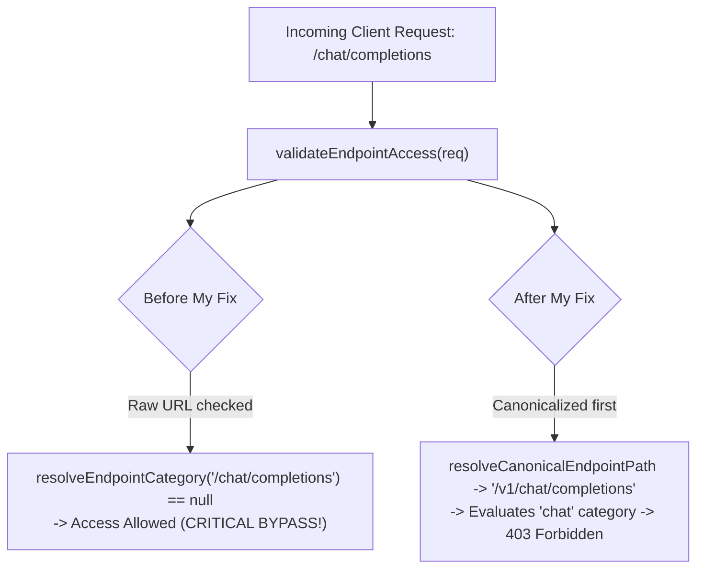
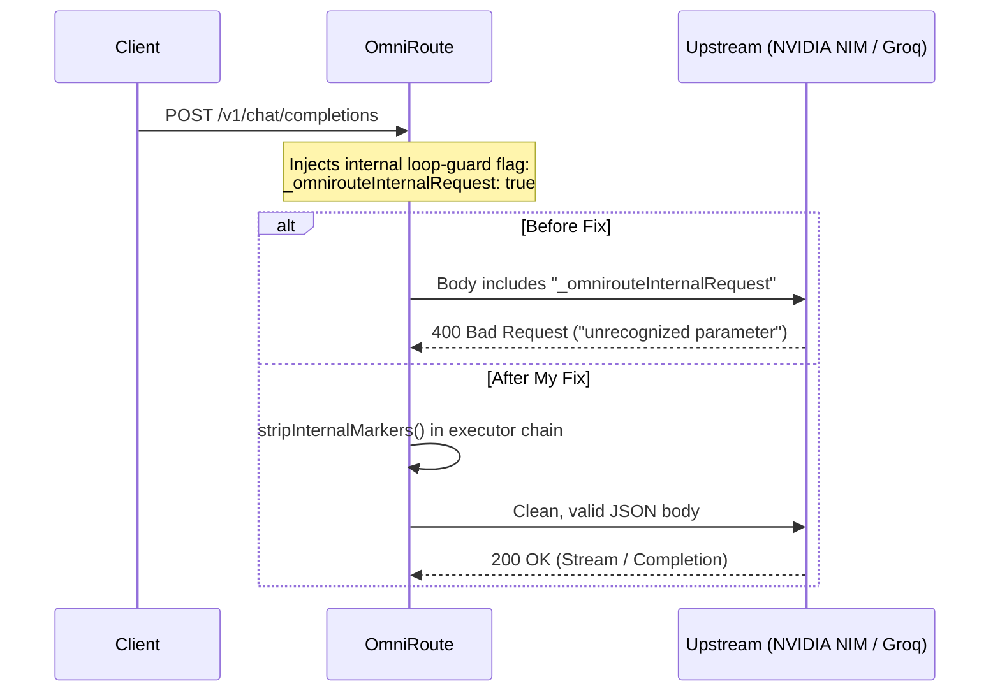

# Upstream Maintenance Log & Engineering Notes

> My running log of production bug fixes, architectural patches, and deep dives across high-traffic open source systems—chiefly [OmniRoute](https://github.com/diegosouzapw/OmniRoute), [Filecraft](https://github.com/Filecraft/Filecraft), and [CEII Platform](https://github.com/Centre-For-Energy/ceii-platform).

When I contribute to complex production codebases, I focus on the problems that quietly fail under load: authorization edge cases, leaked proxy payload markers, database bloat, and flakey CI test harnesses. 

I don't open drive-by typo PRs. I write reproductions first, find the exact line causing the defect, contain the blast radius so nothing else breaks, and write clean tests that keep maintainers confident.

---

## At a Glance

- **Core Focus**: AI Proxy Runtimes, Reverse Proxy Security, SQLite Storage Engines, macOS Native Tooling.
- **Primary Upstream**: [diegosouzapw/OmniRoute](https://github.com/diegosouzapw/OmniRoute) (68k+ stars, 350+ LLM providers, Next.js 16 / TypeScript / Node SSE engine).
- **Status**: 15+ upstream contributions (merged and in review), spanning security, executors, live WebSockets, and database maintenance.

```
Total Tracked Upstream PRs: 18
├── Merged: 10
└── Active / In Review: 8
```

---

## 🛠️ OmniRoute Contributions

[OmniRoute](https://github.com/diegosouzapw/OmniRoute) is a unified AI proxy that routes client traffic across 350+ providers with automatic fallback, streaming protocol translation, and circuit breakers. Here is my breakdown of the problems I've solved in it:

### 1. Storage & Database Maintenance

| PR | Type | What I Found & What I Did | Status |
| :--- | :--- | :--- | :--- |
| **[#14285](https://github.com/diegosouzapw/OmniRoute/pull/14285)** | Bug / Storage | **Fixed 731k+ leaked telemetry rows in `compression_engine_breakdown` ([#14268](https://github.com/diegosouzapw/OmniRoute/issues/14268)).** Stacked prompt compression logged per-engine breakdowns, but the table was omitted from both automated retention cleanup and usage resets. In production instances running 5+ months, this accumulated hundreds of thousands of rows. I wrote `cleanupCompressionEngineBreakdown` with a 30-day cutoff, hooked it into nightly auto-cleanup, and added it to `RESET_TARGETS`. | **Active** |
| **[#14274](https://github.com/diegosouzapw/OmniRoute/pull/14274)** | Fix / Boot | **Silenced false-positive fatal boot alerts during Bifrost slot index renumbering ([#14262](https://github.com/diegosouzapw/OmniRoute/issues/14262)).** Traced migration history for legacy slots 100–105 to prevent the boot sequence from firing critical alarms on expected slot renumbering. | **Active** |



---

### 2. Security & Access Control

| PR | Type | What I Found & What I Did | Status |
| :--- | :--- | :--- | :--- |
| **[#13741](https://github.com/diegosouzapw/OmniRoute/pull/13741)** | Security | **Fixed an authorization bypass on URL rewrite aliases ([#13685](https://github.com/diegosouzapw/OmniRoute/issues/13685)).** When restricted API keys had `allowedEndpoints: ["search"]`, calling aliases like `/chat/completions` or `/codex/*` bypassed the policy engine because `resolveEndpointCategory()` only recognized canonical `/v1/...` routes and returned `null` (which failed open). I implemented `resolveCanonicalEndpointPath()` to normalize aliases before category checks, plugging the hole without altering error paths. | **Merged** |



---

### 3. Streaming Egress & Upstream Serialization

| PR | Type | What I Found & What I Did | Status |
| :--- | :--- | :--- | :--- |
| **[#12735](https://github.com/diegosouzapw/OmniRoute/pull/12735)** | Bug / Egress | **Stripped internal proxy markers from outgoing request bodies ([#12729](https://github.com/diegosouzapw/OmniRoute/issues/12729)).** Internal routing flags like `_omnirouteSkipContextRelay` were being passed through to upstream APIs. Strict providers (NVIDIA NIM and Groq) rejected these with HTTP 400 `Unsupported parameter(s)`. I audited the executor hierarchy and added targeted stripping to executors that bypassed the shared base dispatch (`dario`, `9router`). | **Merged** |
| **[#14153](https://github.com/diegosouzapw/OmniRoute/pull/14153)** | Streaming | **Prevented trailing text from being appended to completed Responses message items.** Kept post-close chunks off already-finalized items during SSE stream translation. | **Active** |



---

### 4. Transports, Routing & Real-Time Engines

| PR | Type | What I Found & What I Did | Status |
| :--- | :--- | :--- | :--- |
| **[#14281](https://github.com/diegosouzapw/OmniRoute/pull/14281)** | Feature / Transports | **Wired Codex App-Server WebSocket transport & reasoning model alias normalization ([#14277](https://github.com/diegosouzapw/OmniRoute/issues/14277)).** Added bi-directional WebSocket client dispatch and normalized suffix aliases (`-low`, `-medium`, `-high`) into turn effort parameters. | **Active** |
| **[#14275](https://github.com/diegosouzapw/OmniRoute/pull/14275)** | Real-Time | **Allowed anonymous dashboard LiveWS connections when `requireLogin=false` ([#14256](https://github.com/diegosouzapw/OmniRoute/issues/14256)).** Fixed unexpected WebSocket disconnections on local dev instances when auth is disabled. | **Active** |
| **[#14271](https://github.com/diegosouzapw/OmniRoute/pull/14271)** | Routing | **Recursively expand combo-ref targets when computing capabilities ([#14232](https://github.com/diegosouzapw/OmniRoute/issues/14232)).** Resolved capability masking where composite fallback targets hid actual downstream model capabilities. | **Active** |
| **[#14185](https://github.com/diegosouzapw/OmniRoute/pull/14185)** | Protocols | **Detect `/v1beta` ingress bodies as OpenAI protocol rather than Claude.** Corrected ingress classifier for non-standard path prefixes. | **Active** |
| **[#14184](https://github.com/diegosouzapw/OmniRoute/pull/14184)** | Networking | **Probe HTTP proxies on default port 80 when port is omitted in connection string.** | **Active** |

---

### 5. UI, CLI & Internationalization

| PR | Type | What I Found & What I Did | Status |
| :--- | :--- | :--- | :--- |
| **[#12736](https://github.com/diegosouzapw/OmniRoute/pull/12736)** | Frontend | **Exposed Modal Base URL field in connection settings modal ([#12704](https://github.com/diegosouzapw/OmniRoute/issues/12704)).** Allowed operators to configure custom upstream base URLs directly from the UI. | **Merged** |
| **[#12371](https://github.com/diegosouzapw/OmniRoute/pull/12371)** | Registry | **Restricted reasoning effort tiers to Kimi K3 base models only.** Prevented incompatible reasoning parameters from being sent to unsupported model variants. | **Merged** |
| **[#12369](https://github.com/diegosouzapw/OmniRoute/pull/12369)** | i18n | **Escaped placeholder variables in ICU single quotes across all 43 locales.** Fixed frontend crashes during user onboarding caused by broken ICU message syntax. | **Merged** |
| **[#12368](https://github.com/diegosouzapw/OmniRoute/pull/12368)** | CLI | **Removed duplicate positional argument in `tunnel create` CLI command.** | **Merged** |
| **[#14155](https://github.com/diegosouzapw/OmniRoute/pull/14155)** | CI / Tooling | **Fixed env/doc synchronization gates on checkouts requiring URL path encoding.** | **Active** |

---

## 🍏 Native macOS & Test Harnesses (Filecraft)

[Filecraft](https://github.com/Filecraft/Filecraft) is a native macOS document export and processing engine written in Swift and AppKit.

| PR | Type | What I Found & What I Did | Status |
| :--- | :--- | :--- | :--- |
| **[#7](https://github.com/Filecraft/Filecraft/pull/7)** | System Test | **Gated macOS GUI test harness on proven synthetic event delivery.** Fixed a painful non-deterministic bug where CI test suites failed after host restarts. macOS Accessibility preflight APIs frequently report cached success even when the window server is dropping synthetic keyboard/mouse events. I built an active virtual `F13` probe to verify actual event delivery before running journeys, with a clean `--human-driven` fallback mode. | **Merged** |
| **[#6](https://github.com/Filecraft/Filecraft/pull/6)**, **[#8](https://github.com/Filecraft/Filecraft/pull/8)** | Packaging | Release packaging and distribution pipeline hardening. | **Merged** |

---

## ⚡ Institutional Systems (CEII Platform)

[CEII Platform](https://github.com/Centre-For-Energy/ceii-platform) is an institutional energy research and web platform.

| PR | Type | What I Found & What I Did | Status |
| :--- | :--- | :--- | :--- |
| **[#1](https://github.com/Centre-For-Energy/ceii-platform/pull/1)**–**[#5](https://github.com/Centre-For-Energy/ceii-platform/pull/5)** | Architecture | Engineered foundational application shell, design system component primitives, modular routing layout, and WCAG AA accessibility compliance framework. | **Merged** |

---

## How I Approach Codebases

When working in someone else's codebase:

1. **Reproduction first**: Never propose a fix until I have an isolated test case failing for the exact reason described in the issue.
2. **Minimal blast radius**: Resist the temptation to refactor unrelated code. If a bug is caused by two leaky classes, patch those two classes; don't rewrite the entire subsystem.
3. **Respect maintainer time**: In [#14152](https://github.com/diegosouzapw/OmniRoute/pull/14152), when I noticed that maintainer PR `#14164` had already cleaned up the same linter issue during a release train, I immediately closed my PR to prevent merge conflicts and save review cycles.
4. **Transparent verification**: Every PR includes exact reproduction commands, terminal traces, and unit test assertions.

---

*Maintained by [@gonisulaimann](https://github.com/gonisulaimann) • [LinkedIn](https://linkedin.com/in/gonisulaimann)*
