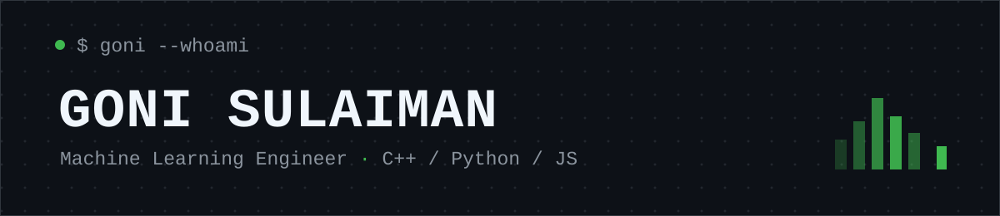

<picture>
  <source media="(prefers-color-scheme: dark)" srcset="./assets/banner.svg" />
  <source media="(prefers-color-scheme: light)" srcset="./assets/banner-light.svg" />
  
</picture>

Machine Learning Engineer building local-first tools and institutional platforms — mostly C++, Python and JavaScript.

 

**[Filecraft](https://github.com/Filecraft/Filecraft)** — local-first file tools. Your original, untouched.
 
**[ceii-platform](https://github.com/Centre-For-Energy/ceii-platform)** — institutional energy platform. Hard boundaries, no leaks.
 
**[OmniRoute](https://github.com/gonisulaimann/OmniRoute)** (fork) — AI-gateway mirror for experiments.

the rest got deleted

<picture>
  <source media="(prefers-color-scheme: dark)" srcset="https://raw.githubusercontent.com/gonisulaimann/gonisulaimann/output/github-snake-dark.svg" />
  <source media="(prefers-color-scheme: light)" srcset="https://raw.githubusercontent.com/gonisulaimann/gonisulaimann/output/github-snake.svg" />
  
</picture>

open an issue on any repo — I read everything

[x](https://x.com/gonisulaimann) · [linkedin](https://linkedin.com/in/gonisulaimann) · [web](https://gonisulaiman.github.io)

